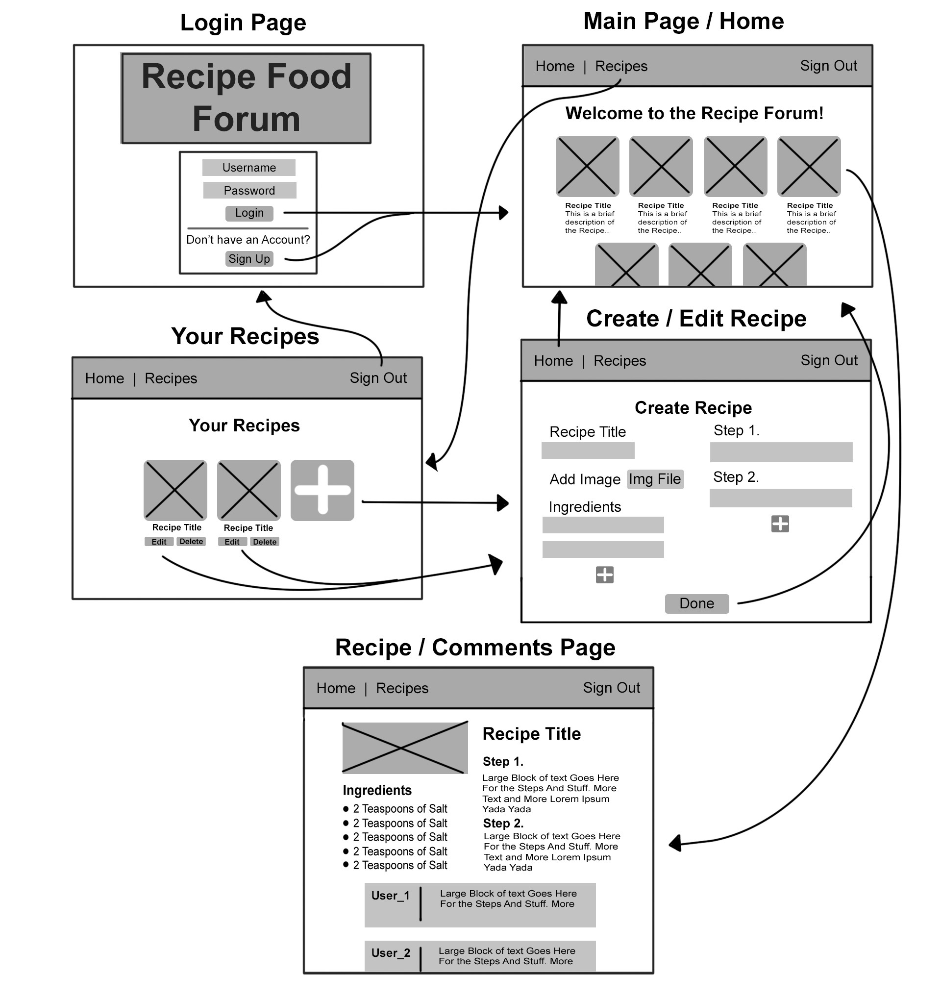

# food-forum-backend

## Description
- A Recipe-Forum app that is a place meant to give food lovers a place to come together and share their favorite recipes and comment on recipes. Check out our app [HERE](https://recipe-forum-client.onrender.com/main)

## Wireframe

## ERD
.png)

## [Trello-Board](https://trello.com/b/Xl8J8a75/food-forum-app)

## MVP
- As a user, I want to view all recipes
- As a user, I want to view a single recipe
- As a user, I want to create a recipe with a name and description
- As a user, I want to be able to edit my recipes name and description
- As a user, I want to delete my recipe
- As a user, I want to be able to add steps to my recipe
- As a user, I want to be able to add ingredients to my recipe
- As a user, I want to be able to sign-in
- As a user, I want to be able to sign-up
- As a user, I want to be able to sign-out
- As a user, I want to be able to create a comment 
- As a user, I want to be able to delete my comment

## Version 2
- As a user, I want to be able to like a recipe
- As a user, I want to be able to dislike a recipe 

## Version 3
- As a user, I want to add user avatars 
- As a user, I want to be able to comment with Emojis
- As a user, I want to be able to search recipes

#  Routes 
| Name | Path | Http Verb | Purpose |
| --- | --- | --- | --- |
| Index | /api/recipes/ | GET | Get all recipes |
| Show | /api/recipes/:id/ | GET | Get one recipe |
| Create | /api/recipes/ | POST | Create one recipe |
| Update | /api/recipes/:id/ | PATCH | Update one recipe |
| Delete | /api/recipes/:id/ | DELETE | Delete one recipe |
| Create | /api/comment/ | POST | Create one comment |
| Delete | /api/comment/:id | DELETE | Delete one comment |
| Sign Up | /api/sign-up/ | POST | Create a user and token |
| Sign In | /api/sign-in/ | POST | Log in and create token |

## Technologies Used
1. Javascript
2. HTML
3. CSS
4. Django
5. Postgresql
6. Cors
7. Django-auth
8. Node
9. REACT
10. Python